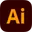

<div align="center">


<a href="https://git.io/typing-svg"></a>

<br/>

[](https://sakib-info.vercel.app/) [](https://drive.google.com/file/d/1SVkjqzotF137lSXntzwZko43RaTt18RD/view) [](https://www.linkedin.com/in/sakib0808/) [](mailto:sakibul.islam0808@gmail.com)

</div>


##  &nbsp;About Me

```javascript
const sakib = {
    pronouns: "he" | "him",
    location: "Dhaka, Bangladesh 🇧🇩",
    currentRole: "Software Engineer @ Riseup Labs",
    experience: "3+ years",
    
    achievements: {
        apiOptimization: "40% load reduction",
        uiPerformance: "30% faster page loads",
        codeQuality: "25% less duplication",
        clientReach: ["🇺🇸 USA", "🇦🇺 Australia"]
    },
    
    currentlyBuilding: "Enterprise-grade applications",
    funFact: "I mass produce commits like it's a factory 🏭"
};
```


### 🎯 Quick Highlights

- 🔥 **3+ years** shipping production-ready code
- 🌍 Built products for **international markets**
- 🏗️ Specialized in **scalable architectures**
- ⚡ **Performance optimization** enthusiast
- 🚀 CI/CD pipeline architect
- 💡 Always learning, always building

<br clear="both"/>

<div align="center">


##  &nbsp;Arsenal of Technologies

### 💻 Languages & Core

<table align="center">
<tr>
<td align="center" width="110">

<br><strong>JavaScript</strong>
</td>
<td align="center" width="110">

<br><strong>TypeScript</strong>
</td>
<td align="center" width="110">

<br><strong>SQL</strong>
</td>
</tr>
</table>

### 🎨 Frontend Ecosystem

<table align="center">
<tr>
<td align="center" width="110">

<br><strong>React</strong>
</td>
<td align="center" width="110">

<br><strong>Next.js</strong>
</td>
<td align="center" width="110">

<br><strong>Redux</strong>
</td>
<td align="center" width="110">

<br><strong>TanStack</strong>
</td>
<td align="center" width="110">

<br><strong>Tailwind</strong>
</td>
</tr>
<tr>
<td align="center" width="110">

<br><strong>ShadCN</strong>
</td>
<td align="center" width="110">

<br><strong>Ant Design</strong>
</td>
<td align="center" width="110">

<br><strong>Framer</strong>
</td>
<td align="center" width="110">

<br><strong>GSAP</strong>
</td>
<td align="center" width="110">

<br><strong>AI</strong>
</td>
</tr>
</table>

### ⚙️ Backend & Database

<table align="center">
<tr>
<td align="center" width="110">

<br><strong>Node.js</strong>
</td>
<td align="center" width="110">

<br><strong>Express</strong>
</td>
<td align="center" width="110">

<br><strong>PostgreSQL</strong>
</td>
<td align="center" width="110">

<br><strong>MongoDB</strong>
</td>
</tr>
<tr>
<td align="center" width="110">

<br><strong>Prisma</strong>
</td>
<td align="center" width="110">

<br><strong>Mongoose</strong>
</td>
<td align="center" width="110">

<br><strong>REST API</strong>
</td>
<td align="center" width="110">

<br><strong>Postman</strong>
</td>
</tr>
</table>

### 🚀 DevOps & Cloud

<table align="center">
<tr>
<td align="center" width="110">

<br><strong>Git</strong>
</td>
<td align="center" width="110">

<br><strong>GitHub</strong>
</td>
<td align="center" width="110">

<br><strong>DigitalOcean</strong>
</td>
<td align="center" width="110">

<br><strong>Cloudflare</strong>
</td>
</tr>
<tr>
<td align="center" width="110">

<br><strong>Coolify</strong>
</td>
<td align="center" width="110">

<br><strong>Hostinger</strong>
</td>
<td align="center" width="110">

<br><strong>VS Code</strong>
</td>
<td align="center" width="110">

<br><strong>Figma</strong>
</td>
</tr>
</table>

<br clear="both"/>

<div align="center">


## 📊 GitHub Analytics

<div align="center">


</div>

<div align="center">

</div>

<br/>

<div align="center">

</div>

<br />


## 💬 Random Dev Quote

<div align="center">

</div>


<div align="center">

## 🤝 Let's Build Something Amazing Together!

<br/>

<a href="mailto:sakibul.islam0808@gmail.com">

</a>
<a href="https://www.linkedin.com/in/sakib0808/">

</a>
<a href="https://sakib-info.vercel.app/">

</a>

<br/><br/>


<br/>

**📍 Mirpur, Dhaka** &nbsp;•&nbsp; **📱 +880 1540581443** &nbsp;•&nbsp; **💼 Open for Opportunities**

<br/>


</div>
